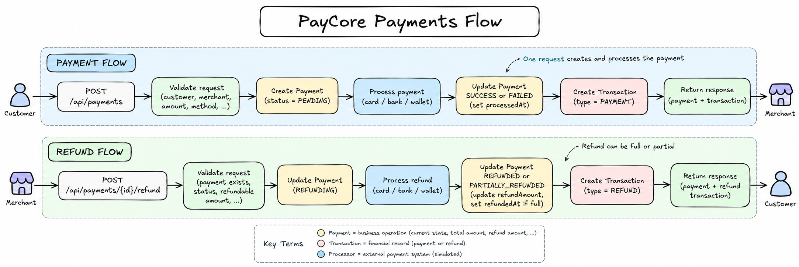

# PayCore

PayCore is a Spring Boot payment-processing simulation built to practice backend engineering around payment lifecycles, transactions, refunds, validation, persistence, and domain state management.

It supports customers and merchants, synchronous payment processing through multiple simulated payment methods, transaction history, and full or partial refunds.

## Documentation

The full v1 technical specification:

- [PayCore v1 Specification](docs/specs/PayCore-Spec-v1.md)

The specification can also be used as a practical Spring Boot exercise covering REST APIs, JPA, validation, transactions, domain modeling, and exception handling.

Reference sheets used while building the project:

- [Java](docs/sheets/JAVA.md)
- [Spring / Spring Boot](docs/sheets/spring.md)
- [REST](docs/sheets/REST.md)

## Flow

<p align="center">
  
</p>

## Run

### Local

Requirements:

- Java 21+
- PostgreSQL

Create a `.env` file at the project root:

```env
DB_URL=jdbc:postgresql://localhost:5432/paycore
DB_USER=postgres
DB_PASSWORD=your_password
```

Run:

```bash
./mvnw spring-boot:run
```

### Docker

Build the image:

```bash
docker build -t paycore .
```

Run:

```bash
docker run \
  -p 8080:8080 \
  -e DB_URL=jdbc:postgresql://host.docker.internal:5432/paycore \
  -e DB_USER=postgres \
  -e DB_PASSWORD=your_password \
  paycore
```

On Linux, if PostgreSQL is running on the host machine:

```bash
docker run \
  --add-host=host.docker.internal:host-gateway \
  -p 8080:8080 \
  -e DB_URL=jdbc:postgresql://host.docker.internal:5432/paycore \
  -e DB_USER=postgres \
  -e DB_PASSWORD=your_password \
  paycore
```